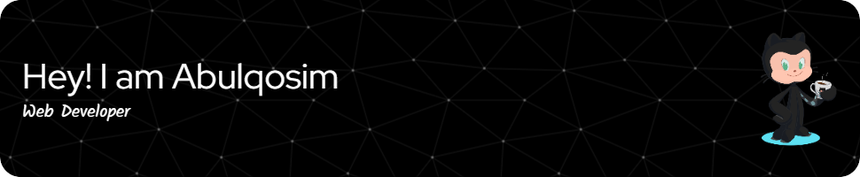

<h3 align="left" style="color: red;">
  Skills
</h3>

  <code></code>
<code></code>
<code></code>
  <code></code>
<code></code>
<code></code>
<code></code>
<code></code>
<code></code>
<code></code>
<code></code>
<code></code>
<code></code>

####

  

<!--    -->
<!-- #### -->
<!--    -->
<!--    -->

 
 
 

  

  

<a> 
    
  
   
</a>

<!--

-->

